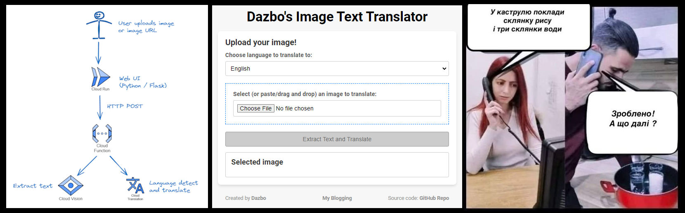

# Image Text Extract and Translation


## Overview

An application that allows a user to upload an image containing text. The text will be extracted, and translated to any selected language.

E.g. A user wants to translate a meme in Ukrainian, to English.

It is built using:

- Python Flask for the UI
- Event driven functions for the backend
- Google Cloud serverless components for hosting: i.e. Cloud Run and Cloud Functions
- Google pre-built ML APIs for the extraction and translation

## Repo Structure

```text
└── image-text-translator
    ├── docs/
    |
    ├── infra-tf/               - Terraform for installing infra
    |
    ├── scripts/                - For environment setup and helper scripts
    |   ├── 00_image-text-translator-sa-setup.sh  - Initial sa setup
    |   ├── 01_env_setup.sh                       - Env setup - run with each new session
    |   └── 02_deployment_sa.sh                   - Deployment sa setup
    |
    ├── app/                    - The Application
    │   ├── ui_cr/                - Browser UI (Cloud Run)
    │   │   ├── static/             - Static content for frontend
    |   |   ├── templates/          - HTML templates for frontend
    |   |   ├── app.py              - The Flask application
    |   |   ├── requirements.txt    - The UI Python requirements
    |   |   ├── Dockerfile          - Dockerfile to build the Flask container
    |   |   └── .dockerignore       - Files to ignore in Dockerfile
    |   |
    │   └── backend_gcf/          - Backend (Cloud Function)
    │       ├── main.py             - The backend CF application
    │       └── requirements.txt    - The backend CF Python requirements
    |
    ├── testing/
    │   └── images/
    |
    ├── requirements.txt          - Python requirements for project local dev
    └── README.md                 - Repo README
```

## Walkthrough and Detailed Guide

Check out my [Medium blog](https://medium.com/google-cloud/building-a-serverless-image-text-extractor-and-translator-using-google-cloud-pre-trained-ai-adfdccdb18d9), where I describe:

- How the solution is architected
- Design choices and rationale
- A walkthrough of how you can do the same, end-to-end, including:
  - Dev environment setup (including Google Cloud SDK, VS Code, Cloud Code)
  - Service accounts and roles
  - Application Default Credentials (ADC)
  - The coding for the UI (Python, Flask, Jinja templates) and backend (Python)
  - How to test locally
  - How to deploy to Google Cloud (using Google Artifact Registry and Cloud Build)
- Cost management tips
- Performance tips

## Todo

Some improvements I'll make soon...

- Captcha
- CI/CD
- IaC